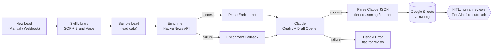

# Project 1 (Day 4) — Lead Qualification & Outreach Agent

An agentic workflow that takes an inbound lead, enriches it with live external data, qualifies it against a RevOps SOP, drafts a personalized first-touch message in brand voice, and logs everything to a CRM sheet — with a human-in-the-loop gate before anything is sent.

**Domain:** Growth / RevOps
**Stack:** n8n · Claude · HackerNews API (enrichment) · Google Sheets (CRM log)

---

## Architecture

---

## How it works

1. **Trigger** — a new lead enters (manual for testing, webhook in production).
2. **Skill Library** — the "company brain": qualification SOP, brand voice, and output format live here as editable data, not hardcoded.
3. **Enrichment** — a live API call gathers real signal about the lead's company. Fails gracefully via a fallback branch so the agent never crashes.
4. **Claude** — qualifies the lead into Tier A/B/C, explains its reasoning, and drafts a first-touch opener in brand voice. Retries on failure, routes to an error handler if it can't recover.
5. **Parse + Log** — the verdict is split into clean fields and appended as a row to a Google Sheet acting as a lightweight CRM.
6. **HITL gate** — no message is auto-sent. A human reviews Tier A leads before outreach (implemented Day 5).

---

## Design decisions
- **Skills as data:** behavior is edited in one node, not buried in API calls — fast iteration, no code surgery.
- **Graceful degradation:** every external dependency (enrichment, LLM) has a fallback or error branch. Production workflows don't crash on bad input.
- **Human in the loop:** the agent *drafts and proposes*; a human *approves* anything that touches a customer. This is the core production-safety boundary.

## Status
- [x] Happy path: enrichment → qualification → structured logging
- [ ] HITL approval gate (Day 5)
- [ ] Input validation + output guardrails (Day 5)
- [ ] README demo GIF + polish (Day 6)
